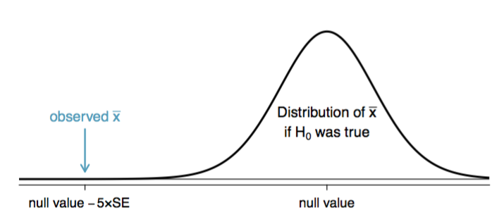
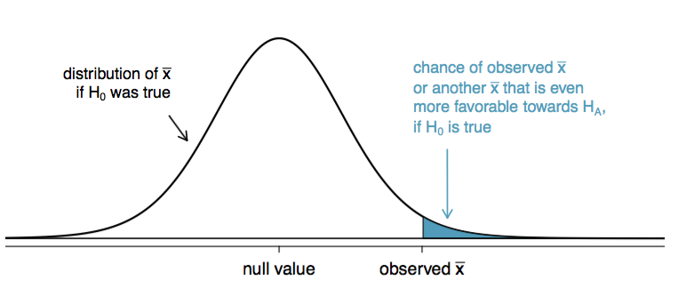

## Course Logistic

* Every Wednesday 19:00 - 21:00
* Slides: http://nikolaypavlov.github.io/da-workshops-5/
* Skype Chat: https://join.skype.com/gjN0CfAd4bhg
* Reference Book: https://www.openintro.org/stat/textbook.php
* [Resampling methods](https://en.wikipedia.org/wiki/Resampling_(statistics)
* Install the following packages: openintro, ggplot2, dplyr

```{r, echo=F, include=F}
options(warn=-1)
```

---
## Topics

* Point estimates
* Confidence intervals
* Bootstrap
* Hypothesis testing framework
* Hypothesis testing using confidence intervals
* Decision errors
* Hypothesis testing using p-values

```{r, echo=F, include=F}
library(openintro)
library(ggplot2)
library(dplyr)
data(quakes)
```

---
## Point estimates and variability

* What is the average depth of quakes near Fiji?
* Waht is the average magnitude of quakes near Fiji?

```{r, fig.height = 5, fig.width = 8}
qplot(data = quakes, x = lat, y = long, size = exp(mag), color = mag, alpha = I(.5))
```

---
## Point estimates and variability

```{r}
set.seed(3)
quakes_smp <- quakes[sample(1:nrow(quakes), 50), ]
c(mean(quakes_smp$depth), mean(quakes_smp$mag))
```

```{r}
options(stringsAsFactors=F)
est <- data.frame(mag='mean', estimate=mean(quakes_smp$mag), parameter=mean(quakes$mag))
est <- rbind(est, c('median', median(quakes_smp$mag), median(quakes$mag)))
est <- rbind(est, c('st.dev', sd(quakes_smp$mag), sd(quakes$mag)))
est
```

---
## Point estimates and variability

```{r, fig.height = 5, fig.width = 8}
running_mean <- sapply(1:1000, function(i) mean(sample(quakes$mag, i)))
plot(running_mean, type="l", xlab="Sample size", ylab="Estimate of magnitude mean")
abline(h=mean(quakes$mag), col="red", lwd=3)
```

---
## Standard error of the mean: $SE_{\overline{x}} = \frac{s}{\sqrt{n}}$

```{r, fig.height = 5, fig.width = 8}
set.seed(10)
sampling_mean <- sapply(1:1000, function(x) mean(sample(quakes$mag, 50)))
hist(sampling_mean, breaks=50, main="Sampling distribution", xlab="Sample mean")
```

---
## 95% confidence interval: $\overline{x} \pm 1.96 \times SE_{\overline{x}}$

```{r, fig.height = 5, fig.width = 8, cache=T}
set.seed(10)
sampling_mean <- sapply(1:100500, function(x) mean(sample(quakes$mag, 50)))
hist(sampling_mean, breaks=50, main="Sampling distribution", xlab="Sample mean")
```

--- 
## What about practice?

Important conditions to ensure $\overline{x}$ sampling distrubtion is normal and $SE_\overline{x}$ is accurate:

* The sample observations are independent
  + If the observations are from a simple random sample and n < 10% of the population, then they are independent.
  + Subjects in an experiment are considered independent if they undergo random assignment to the treatment groups.
* The sample size is large: n > 30 is a good rule of thumb
  + If not use t-statistics
* The population distribution is not strongly skewed
  + When there are prominent outliers present, the sample should contain at least 100 observations, and in some cases, much more.
  + Use bootstrap-t

Use your best judgement.

--- 
## Interpreting confidence intervals

### Incorrect:

* The confidence interval capturing the population parameter with a certain probability
* The confidence of capturing individual observations, a proportion of the observations, or point estimates

### Correct:

* Were this sampling procedure to be repeated on multiple samples, the calculated confidence interval (which would differ for each sample) would encompass the true population parameter 95% of the time.
* There is a 95% probability that the calculated confidence interval from some future experiment encompasses the true value of the population parameter.

--- 
## Exercises

* Calculate $SE_{\overline{mag}}$ of the $quakes\_smp$ using sample standard deviation.
```{r, echo=F, include=F}
se <- sd(quakes_smp$mag) / sqrt(length(quakes_smp$mag))
```
* What is 95% confidence interval?
```{r, echo=F, include=F}
ci95l <- mean(quakes_smp$mag) - 1.96 * se
ci95u <- mean(quakes_smp$mag) + 1.96 * se
```
* Create a 90% confidence interval?
```{r, echo=F, include=F}
ci90l <- mean(quakes_smp$mag) - qnorm(0.95) * se
ci90u <- mean(quakes_smp$mag) + qnorm(0.95) * se
```

---
## Bootstrap

* Suppose that we have a statistic that estimates some population parameter, but we don't know its sampling distribution
* The bootstrap principle suggests using the distribution defined by the data to approximate its sampling distribution

1. Sample many data sets from the observed data with replacement 
2. Calculate the statistic for each simulated data set
3. Use the simulated statistics to either define a confidence interval or take the standard deviation to calculate a standard error

This is approximately drawing from the sampling distribution of that statistic, at least as far as the data is able to approximate the true population distribution

---
## Example code

```{r}
set.seed(23)
median_bootstr <- sapply(1:100500, function(x) { 
  median(sample(quakes_smp$mag, 50, replace=T))
})
print(sd(median_bootstr))
print(quantile(median_bootstr, c(0.025, 0.975)))
```

---
## Histogram

```{r, fig.height = 5, fig.width = 12, cache=T}
set.seed(3)
median_sampling <- sapply(1:100500, function(x) median(sample(quakes$mag, 50)))
par(mfrow=c(1,2))
hist(median_bootstr, breaks=5, xlab="Median", main="Bootstrapped distribution")
hist(median_sampling, breaks=5, xlab="Median", main="Sampling distribution")
```

---
## Hypothesis testing

Students from the 2011 YRBSS lifted weights (or performed other strength training exercises) 3.09 days per week on average. Are students lifting weights or performing other strength training exercises more or less often in 2013 than they have in 2011?

### Youth Risk Behavior Surveillance System dataset

```{r}
str(yrbss.samp)
```

---
## Hypothesis testing framework

The average days per week that YRBSS students lifted weights for 2011 and 2013 was:

* $H_0$: Same (Null hypothesis)
* $H_A$: Different (Alternative hypothesis)

The skeptic will not reject the null hypothesis ($H_0$), unless the evidence in favor of the alternative hypothesis ($H_A$) is so strong that she rejects $H_0$ in favor of $H_A$. Failing to find strong evidence for the alternative hypothesis is not equivalent to accepting the null hypothesis.

---
## Hypothesis testing framework

* $H_0: \mu_{13} = 3.09$ Null value
* $H_A: \mu_{13} \neq 3.09$ Null value

```{r}
mean(yrbss.samp$strength_training_7d)
```

However, to evaluate whether this provides strong evidence that there has been a change, we must consider the uncertainty associated with $\mu_{13}$

---
## Testing hypotheses using confidence intervals

$x_\overline{x} \pm z \times SE_\overline{x}$

```{r}
htest <- as.data.frame(
  yrbss.samp %>%
  select(strength_training_7d) %>%
  summarise(avg=mean(strength_training_7d), 
            se=mean(strength_training_7d) / sqrt(length(strength_training_7d)), 
            lower=avg - 1.96 * se,
            upper=avg + 1.96 * se,
            num=length(strength_training_7d)))
htest
```

---
## Exercises

1. Colleges frequently provide estimates of student expenses such as housing. A consultant hired by a community college claimed that the average student housing expense was 650 dollars per month. What are the $H_0$ and $H_A$ to test whether this claim is accurate?
2. The college decides to collect data to evaluate the claim. They take a random sample of 175 students. The sample mean for student housing is 621.91 dollars and the sample standard deviation is 125.34 dollars. Construct a 95% confidence interval for the population mean and evaluate the hypotheses.

```{r, echo=F, include=F}
sleep_se <- 125.34 / sqrt(175)
c(621.91 - 1.96 * sleep_se, 621.91 + 1.96 * sleep_se)
```

--- 
## Decision errors


### What precisely does strong evidence mean?

As a general rule of thumb, for those cases where the null hypothesis is actually true, we do not want to incorrectly reject $H_0$ more than 5% of the time.

$\alpha = 0.05$ - a significance level

---
## p-value

Consider the following two cases:

* The null value is in the 95% confidence interval but just barely, so we would not reject $H_0$. However, we might like to somehow say, quantitatively, that it was a close decision.
* The null value is very far outside of the interval, so we reject $H_0$. However, we want to communicate that, not only did we reject the null hypothesis, but it wasn’t even close.



---
## p-value formal definition

* $P(X \geq x | H_0)$ for right tail event
* $P(X \leq x | H_0)$ for left tail event
* $2 min \{P(X \leq x | H_0), P(X \geq x | H_0)\}$ for double tail event

The p-value is defined as the probability of obtaining a result equal to or more extreme than what was actually observed, under the assumption of hypothesis $H_0$ is true.

--- 
## Example

A poll by the National Sleep Foundation found that college students average about 7 hours of sleep per night. Researchers at a rural school are interested in showing that students at their school sleep longer than seven hours on average, and they would like to demonstrate this using a sample of students. What would be an appropriate skeptical position for this research?

* $H_0: \mu = 7$
* $H_A: \mu > 7$ - One-sided test

Other options: 

* $H_A: \mu < 7$ - One-sided test
* $H_A: \mu \neq 7$ - Two-sided test

---
## Example

* In the sleep study, they found that these students averaged 7.42 hours of sleep and the standard deviation of the amount of sleep was 1.75 hours. The sample size is 110.
* They use a simple random sample from less than 10% of the students.
* The hypothesis test for the sleep study will be evaluated using a significance level of $\alpha = 0.05$

$Z = \frac{\overline{x} - \text{null value}}{SE_{\overline{x}}}$

```{r}
z = (7.42 - 7) / 0.17
1 - pnorm(z)
```

---
## Explanation

If the null hypothesis is true, the probability of observing a sample mean at least as large as 7.42 hours for a sample of 110 students is only 0.007.


---
## Testing hypotheses using p-value intervals

1. We are skeptical. We reject this position only if the evidence strongly favors $H_A$
2. A small p-value means that if the $H_0$ is true, there is a low probability of seeing a point estimate at least as extreme as we saw. This as strong evidence in favor of the $H_A$
3. We reject the $H_0$ if the p-value $< \alpha$, usually 0.05. Otherwise, we fail to reject $H_0$
4. We should always state the conclusion of the hypothesis test in plain language so non-statisticians can also understand the results



---
## Exercises

* If the null hypothesis is true, how often should the p-value be less than 0.05?
* Suppose we had used a significance level of 0.01 in the sleep study. Would the evidence have been strong enough to reject the null hypothesis? What if the significance level was $\alpha = 0.001$?
* Ebay might be interested in showing that buyers on its site tend to pay less than they would for the corresponding new item on Amazon. We’ll research this topic for one particular product: a video game called Mario Kart for the Nintendo Wii. During early October 2009, Amazon sold this game for 46.99 dollars. Set up an appropriate hypothesis test to check the claim that Ebay buyers pay less during auctions at this same time.
* The average sale price of the 58 Ebay auctions for Wii Mario Kart was 44.7 dollars with a standard deviation of 4.11 dollars. Does this provide suficient evidence to reject the $H_0$? Use $\alpha = 0.01$

```{r, echo=F, include=F}
mario_se <- 4.11 / sqrt(58)
mario_z <- (44.7 - 46.99) / mario_se
mario_p <- pnorm(mario_z)
```

---
## Exercises

* Earlier we talked about a research group investigating whether the students at their school slept well at night. Let’s consider a second group of researchers who want to evaluate whether the students at their college differ from the norm of 8 hours. Write the null and alternative hypotheses for this investigation.
* The second college randomly samples 127 students and finds a mean of $\overline{x} = 7.83$ hours and a standard deviation of 1.8 hours. Does this provide strong evidence against $H_0$? Use $\alpha = 0.05$.

```{r, echo=F, include=F}
sleep_se2 <- 1.8 / sqrt(127)
sleep_z <- (7.83 - 8) / sleep_se2
sleep_p <- 2 * pnorm(sleep_z)
```

---
## Homework

* [Lab 5 - Foundations for statistical inference](http://htmlpreview.github.io/?https://github.com/andrewpbray/oiLabs-base-R/blob/master/sampling_distributions/sampling_distributions.html)
* Skype Chat for discussions: https://join.skype.com/gjN0CfAd4bhg
* Reading: OpenIntro Statistics Chapter 4.
* Reference Book: https://www.openintro.org/stat/textbook.php
* [Resampling methods](https://en.wikipedia.org/wiki/Resampling_(statistics)

